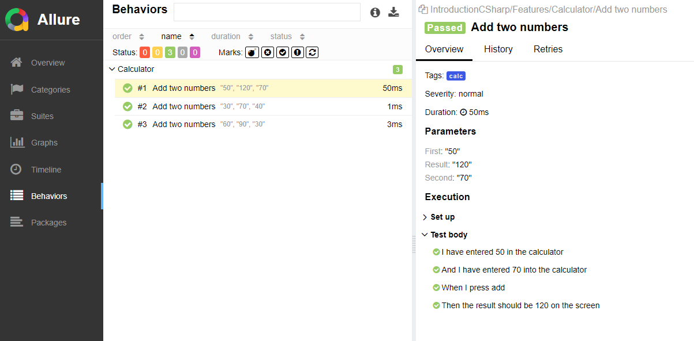

# Introduction Testing with CSharp 

## Framework for testing with BDD

### Dependencies
- Nunit
- SpecFlow
- FluentAssertions
- Allure (for report)


#### Install Allure (for Windows)
##### Dependencies:
- Java / [Link](https://javadl.oracle.com/webapps/download/AutoDL?BundleId=251391_0d8f12bc927a4e2c9f8568ca567db4ee)
- Scoop / [Link](https://github.com/ScoopInstaller/Install#readme)

```shell
scoop install allure
```


#### Run tests
```shell
dotnet test
```

#### View report Allure
```shell
allure serve
```

#### Generate report Allure
```shell
allure generate
```

#### Example report

